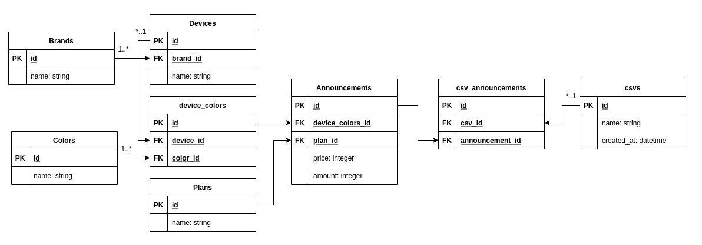

- [Introduction](#sparkles-introduction)
  - [About](#pushpin-about)
  - [Technologies](#pushpin-technologies)
  - [Features](#pushpin-features)
- [Getting Started](#sparkles-getting-started)
  - [Running our app](#pushpin-running-our-app)
- [Expected CSV](#sparkles-getting-started)

# :sparkles: Introduction

SmartPhone Catalog it's an app where you can upload data from a CSV file and seed a DB made for selling cellphones. You can also list and filter the data you uploaded. It was made to be flexible and also logical with an scalable and still simple database modeling. That's our initial documentation:



SmartPhone Catalog also provides you a simple API decoupled from web's controller business logic, so we can add and control data beyond our initial planning, adding new brands or devices without needing to upload from CSV directly. It'll be easier to implement any kinda of form and also make basic CRUD changes by the way this app was made.

It's not a piece of cake, still. Error handling can be hard and useless if it's spread over the app as it's now and the only specs coverage facade are between models and API. The services could be refactored and maybe an async processing made with Sidekiq or a cache feature could help us handling more data volume. Dockerizing our app could also improve developer experience.

Still a WIP, but works.
## :pushpin: Technologies

- Ruby On Rails
- RSpec
- Bootstrap
- Active Model Serializer
- FactoryBot
- MySQL

## :pushpin: Features

- [x] Upload CSV data to the DB
- [x] List CSV data
- [x] List and filter all DB data

# :sparkles: Getting Started

## :pushpin: Clone this repository

`git clone https://github.com/marianasmmattos/smartphones_catalog.git`

`cd smartphones_catalog`

## :pushpin: Running it

Open a terminal window.

1. First, create database

  `rails db:create`

2. Then, run our migrations so the schema is up to date

  `rails db:migrate`

3. Run our app!

  `bin/rails server` or `rails s`

# :pushpin: Expected CSV

So, to seed our db you need to provide a certain type of CSV format. You can find it at `input_valid.csv`.
The collums should be:

| manufacturer |  model          | color        |  carrier_plan_type | quantity    |  price   |
|--------------|-----------------|--------------|--------------------|-------------|----------|
|    string    |     string      |    string    |     pre / pos      |     int     |  int     |

# :pushpin: API Docummentation

## Endpoints - v1

### Announcements

```
/api/announcements/
Method: GET
```

```
/api/announcements/:id
Method: GET
```

```
/api/announcements?:device_color_id&:plan_id&:price&:amount
Method: POST
```

### Brands

! WIP !